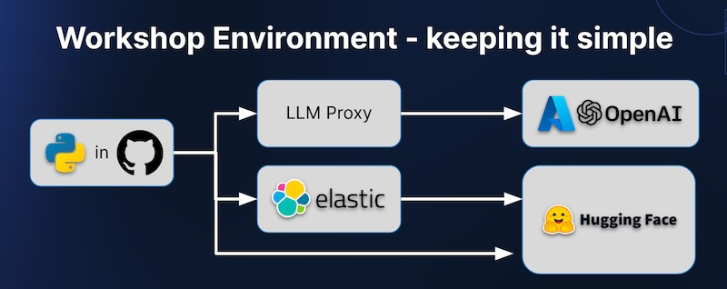
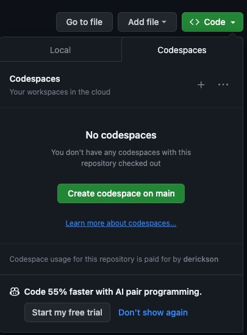

# GenAI Dev Workshop - Azure

Welome to this Elastic GenAI Workshop for Developers.  We'll be using Github Codespaces as our Python development environement and different back end services to compare and contrast ways of creating embedding models, implementing semantic search, and using Large Language Models like Azure OpenAI ChatGPT.

## To run this lab you will need:
* a workshop key from your instructor to load the environment variables required to run these notebooks
* your own github account to use the free Github Codespaces execution environment

## Instructions

Follow [this link](https://codespaces.new/elastic/genai-workshop-codespaces/tree/main) to launch the workshop in GitHub Codespaces.

Alternatively, from this repository, start a Github Codespaces execution environment: click the green "<> Code" buttun above and to the right and select "Create codespace on main".

Once the environment loads, the first step in the notebook will try to load the environment variables required to run the workshop. Please enter the workshop key provided to you by in the instructor.

## If you close your codespace accidentally

You can get back to it here: https://github.com/codespaces 

## Shutting it down when you are done

Make sure to shut down the codespace when you are done with it. You can do that from here: https://github.com/codespaces 